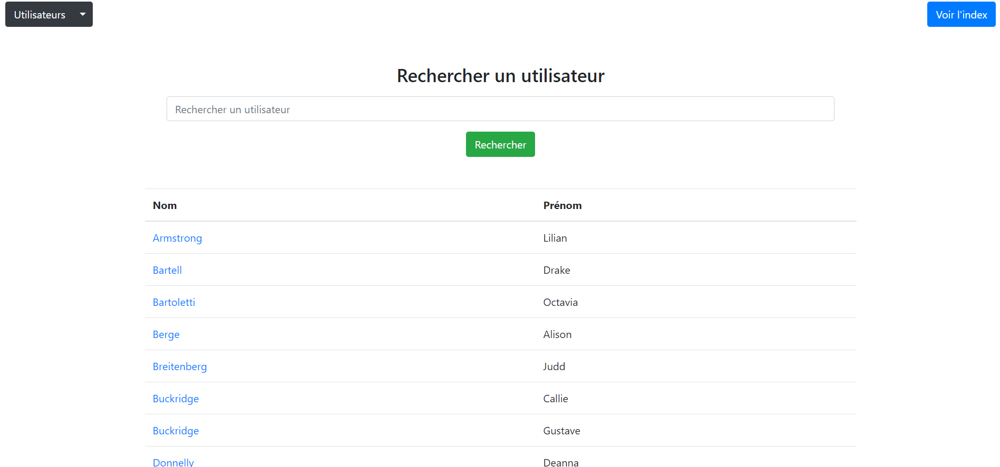

# Moteur de recherche d'utilisateur PHP

Il s'agit du code de base d'un moteur de recherche d'utilisateur en PHP. En effet, un moteur de recherche demande beaucoup de travail, d'abord en raison de la diversité du contenu à rechercher, ensuite de la complexité des requêtes à traiter enfin du temps de reponse et de la pertinence des résultats. Pour bon nombre de critères à établir. Dans notre cas, il s'agit du code de démarage d'un moteur de recherche pour rechercher des utilisateurs dans une base de données à partir de leur nom et prénom. Bien entendu le code n'est pas parfait, je dirais pas tu tout mais il permet de bien démarrer la réalisation d'un moteur surtout si on ne s'y connais pas( Comme moi au momment ou j'écris :] ).

## Installation
```
  git clone https://github.com/jdjebi/php-web-engine-starterr
```

## Usage

Il y'a pas grand chose à faire. Une fois cloné, il suffit juste de créer une base de données et d'y importer celle du moteur.

1. Importer la base de données
2. Configurer le fichier de connexion à la de données
3. Vider la table des utilisateurs
4. Générer des utilisateurs
5. Effectuer des recherches

Le nom de la base de données par défaut est **web_engine** conformenent au fichier pour la connexion à la base de données `config\db.php`

Le fichier de la base de données(des tables) se trouve dans ce ici: `database\web_engine_database.sql`.
Il contient par défaut des données que vous pouvez utiliser dès le premier lancement du moteur mais je vous recommande de vider la table des utilisateurs et de l'index pour s'assurer que tout fonctionne correctement. Vous pourrez le faire depuis l'interface via le bouton utilisateur.

Une fois la base de données importées n'oubliez pas de mettre à jour le fichier `config\db.php` si besoin:

```php
<?php
    return [
    "host" => "localhost",
    "username" => "root",
    "password" => "",
    "dbname" => "web_engine" // Changer dbname par le nom de votre base de données
    ];
?>
```

Par ailleurs, les dépendances à savoir principalement `fzaninotto\faker`(Utiliser pour générer des utilisateurs depuis le bouton utilisateur de l'interface) ont déjà été intégré au dépôt en raison le leur faible nombre. Donc pas besoin de faire un `composer install`.

Si vous avez bien suivi les étapes ci-dessus et n'avez rencontrez de problème, alors en ouvrant votre navigateur à la racine du dossier du moteur alors vous aurez cette interface:



## Principe de fonctionnement

Partons d'un base de données vide. D'abord, on doit générer des utilisateurs. Lors de la génération, un index est créé et ce dernier contient les mots de clés qui designe un utilisateur. Par exemple pour un utilisateur de nom `Djebi Jean-Marc` on aura comme mots clés: `Djebi;Jean-Marc,Djebi Jean-Marc;Jean-Marc Djebi`. D'où la base de données ci-dessous:

```php
Table utilisateur
| id | name  | surname   |
|----|-------|-----------|
| 4  | Djebi | Jean-Marc |

Table Index
| id | user_id | keywords                                        |
|----|---------|-------------------------------------------------|
| 1  | 4       | Djebi;Jean-Marc,Djebi Jean-Marc;Jean-Marc Djebi |

```

Ainsi, au lieu de rechercher un utilisateur dans la table des utilisateurs, on le recherche dans la table de l'index précisement à partir du champ des mots clés. Cela permet de faciliter la recherche et d'étendre ses possibilités. Ci-dessous la requête utilisée:

```sql
SELECT * FROM searchuserindex WHERE keywords LIKE '%$search_query%'
```
qui est très éfficace pour les requêtes hétérogènes au lieu de:
```sql
SELECT * FROM user WHERE name LIKE '%$search_query%' || surname LIKE '%$search_query%'
```
qui l'est moins (les requêtes de type Nom + Prénom donnerons très rarement, voir pas du tout, de bons résultats) .

## Contribution

Ainsi présenter mon travail. Bien entendu il n'est pas abouti et peut toujours être amélioré. C'est pourquoi je vous invite à me faire part d'éventuels bugs ou erreurs voir même de fonctionnalités en particulier au niveau du fonctionnement de moteur.
